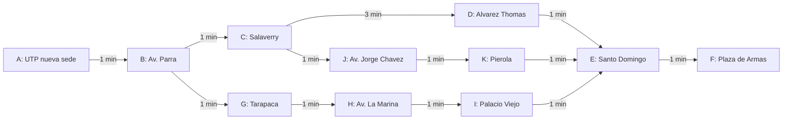

# 01. Ruta optima para conductor en inDrive

## Historia de usuario

**Titulo:** Visualizacion de busqueda de ruta hacia el destino

**Como** conductor de inDrive,  
**quiero** ver la ruta mas rapida desde mi ubicacion actual hacia el destino del pasajero,  
**para** completar el viaje de forma eficiente.

## Criterios de aceptacion

```gherkin
Scenario: Ver la ruta hacia el destino
  Given ya recogi al pasajero
  And mi ubicacion actual esta disponible
  And el destino del pasajero esta disponible
  When presiono el boton "Calcular ruta"
  Then veo la ruta sugerida hacia el destino
  And veo el tiempo estimado de llegada

Scenario: Ruta no disponible
  Given ya recogi al pasajero
  And no existe una ruta disponible hacia el destino
  When presiono el boton "Calcular ruta"
  Then veo el mensaje "No se encontro una ruta disponible"

Scenario: Datos incompletos
  Given falta mi ubicacion actual o el destino del pasajero
  When presiono el boton "Calcular ruta"
  Then veo un mensaje indicando que falta informacion
```

## Tareas tecnicas

- Definir un mapa pequeno como grafo.
- Crear nodos para ubicacion actual del conductor, destino e intersecciones.
- Crear conexiones entre nodos con costo de tiempo.
- Implementar busqueda por profundidad DFS.
- Implementar busqueda por anchura BFS.
- Implementar busqueda exhaustiva para mapas pequenos.
- Implementar Hill Climbing usando una evaluacion local: tiempo hacia el siguiente nodo + nodos restantes estimados.
- Implementar A* usando la formula `f(n) = g(n) + h(n)`.
- Calcular la ruta mas rapida desde la ubicacion actual hasta el destino.
- Mostrar ruta sugerida, tiempo estimado y puntos revisados.
- Comparar resultados entre algoritmos como parte del analisis tecnico.

## Tema del curso

Este proyecto trata del:

**2. Busqueda**

Subtemas:

- Busqueda por profundidad.
- Busqueda por anchura.
- Busqueda exhaustiva.
- Busqueda con Hill Climbing.
- Busqueda con A*.

## Idea del proyecto

Construir una aplicacion educativa inspirada en el calculo de rutas para conductores de inDrive.

El escenario empieza cuando el conductor ya recogio al pasajero. La app debe sugerir la ruta mas rapida hacia el destino.

```txt
Ubicacion actual del conductor -> destino del pasajero
```

Para el ejemplo del curso, el mapa se ubicara en el centro de Arequipa, considerando la UTP nueva sede como ubicacion actual del conductor.

La app no representa el funcionamiento interno real de inDrive. Es una version simplificada para aprender algoritmos de busqueda usando un caso realista de movilidad.

## Problema aplicativo

El sistema conoce:

```txt
ubicacion actual del conductor
destino del pasajero
calles o rutas disponibles
tiempo estimado entre nodos
```

El objetivo es sugerir la ruta mas rapida para completar el viaje.

## Escenario

Ejemplo:

```txt
Conductor: UTP nueva sede
Destino: Plaza de Armas de Arequipa
```

Ruta sugerida:

```txt
A -> B -> C -> J -> K -> E -> F
```

## Representacion como grafo

El mapa se representa como un grafo.

```txt
Nodos = ubicaciones o intersecciones
Aristas = calles o rutas entre ubicaciones
Costos = tiempo de recorrido
```

## Nodos del ejemplo

Para evitar confusion, cada ubicacion se representa con una letra:

| Nodo | Ubicacion |
| ---- | --------- |
| A | UTP nueva sede |
| B | Av. Parra |
| C | Salaverry |
| D | Alvarez Thomas |
| E | Santo Domingo |
| F | Plaza de Armas |
| G | Tarapaca |
| H | Av. La Marina |
| I | Palacio Viejo |
| J | Av. Jorge Chavez |
| K | Pierola |

En este caso:

```txt
A = ubicacion actual del conductor
F = destino del pasajero
```

## Grafo del ejemplo



Rutas posibles:

```txt
A -> B -> C -> D -> E -> F
A -> B -> C -> J -> K -> E -> F
A -> B -> G -> H -> I -> E -> F
```

El grafo no incluye atajos directos entre puntos no consecutivos. Cada conexion representa una relacion directa entre dos nodos del recorrido definido.

## Datos de ejemplo

| Origen | Destino | Conexion | Tiempo | Trafico |
| ------ | ------- | ----- | -----: | ------- |
| A | B | UTP nueva sede -> Av. Parra | 1 min | bajo |
| B | C | Av. Parra -> Salaverry | 1 min | medio |
| C | D | Salaverry -> Alvarez Thomas | 3 min | medio |
| D | E | Alvarez Thomas -> Santo Domingo | 1 min | bajo |
| E | F | Santo Domingo -> Plaza de Armas | 1 min | medio |
| C | J | Salaverry -> Av. Jorge Chavez | 1 min | medio |
| J | K | Av. Jorge Chavez -> Pierola | 1 min | medio |
| K | E | Pierola -> Santo Domingo | 1 min | bajo |
| B | G | Av. Parra -> Tarapaca | 1 min | bajo |
| G | H | Tarapaca -> Av. La Marina | 1 min | bajo |
| H | I | Av. La Marina -> Palacio Viejo | 1 min | bajo |
| I | E | Palacio Viejo -> Santo Domingo | 1 min | bajo |

## Rutas candidatas del ejemplo

| Ruta | Recorrido | Tiempo | Trafico esperado |
| ---- | --------- | -----: | ---------------- |
| Ruta optima | A -> B -> C -> J -> K -> E -> F | 6 min | medio |
| Ruta por Alvarez Thomas | A -> B -> C -> D -> E -> F | 7 min | medio |
| Ruta alternativa con menos trafico | A -> B -> G -> H -> I -> E -> F | 6 min | bajo |

## Estados del problema

Estado inicial:

```txt
El conductor esta en su ubicacion actual con el pasajero a bordo.
```

Estados intermedios:

```txt
avanzar por una ruta disponible
pasar por una interseccion
evitar una zona con trafico
```

Estado objetivo:

```txt
El conductor llega al destino del pasajero.
```

## Acciones posibles

Desde cada punto del mapa, el conductor puede moverse a ubicaciones conectadas.

Ejemplo:

```txt
Desde UTP nueva sede puede ir a:
- Av. Parra
```

## Costo de movimiento

Cada conexion entre nodos tiene un costo.

Para esta primera version:

```txt
costo = tiempo estimado en minutos
```

## Busqueda por profundidad DFS

DFS explora una ruta completa antes de probar otra.

Aplicado al viaje:

```txt
1. El conductor sigue una ruta posible.
2. Avanza por esa ruta hasta el final.
3. Si no llega al destino, retrocede.
4. Prueba otra ruta.
```

Limitacion:

```txt
No garantiza encontrar la ruta mas rapida.
```

## Busqueda por anchura BFS

BFS explora primero las rutas con menos nodos.

Aplicado al viaje:

```txt
1. Revisa primero los nodos conectados al origen.
2. Luego revisa los nodos del siguiente nivel.
3. Continua hasta llegar al destino.
```

Limitacion:

```txt
Menos nodos no siempre significa menor tiempo.
```

En esta app, BFS puede encontrar una ruta con pocos nodos antes que la ruta de menor tiempo. Por eso su resultado puede ser diferente a la Ruta optima.

## Busqueda exhaustiva

La busqueda exhaustiva revisa todas las rutas posibles.

Aplicado al viaje:

```txt
1. Genera todas las rutas validas.
2. Calcula el tiempo total de cada una.
3. Compara las rutas.
4. Elige la ruta con menor tiempo.
```

Limitacion:

```txt
Solo es razonable en mapas pequenos.
```

## Hill Climbing

Hill Climbing elige el siguiente movimiento que parece mejor en ese momento.

Heuristica posible:

```txt
minimo numero de nodos restantes hasta el destino
```

En la app se usa una evaluacion local:

```txt
puntaje local = tiempo hacia el siguiente nodo + estimacion restante del vecino
```

Esto evita elegir una calle solo por una decision visual, ignorando que puede tener mucho tiempo de recorrido.

Limitacion:

```txt
Puede encontrar una ruta razonable, pero no garantiza la ruta optima porque no compara todo el camino acumulado.
```

## A*

A* combina costo real acumulado y estimacion restante.

Formula:

```txt
f(n) = g(n) + h(n)
```

Donde:

```txt
g(n) = minutos ya recorridos
h(n) = minimo numero de nodos restantes hasta F
f(n) = prioridad de esa ruta
```

Esta heuristica funciona para el ejemplo porque cada conexion entre nodos cuesta al menos 1 minuto. Por eso el numero de nodos restantes es una estimacion optimista del tiempo que falta.

Ejemplo:

```txt
Desde el nodo C, A* evalua:

C -> D:
g(n) = 5 minutos acumulados
h(n) = 2 nodos restantes desde D
f(n) = 7

C -> J:
g(n) = 3 minutos acumulados
h(n) = 3 nodos restantes desde J
f(n) = 6

Decision:
priorizar C -> J
```

Heuristica usada en el ejemplo:

| Nodo | h(n): nodos minimos restantes hasta F |
| ---- | -------------------------------------: |
| A | 5 |
| B | 4 |
| C | 3 |
| D | 2 |
| E | 1 |
| F | 0 |
| G | 4 |
| H | 3 |
| I | 2 |
| J | 3 |
| K | 2 |

## Funcionamiento de la app

La aplicacion debe permitir:

```txt
1. Ver que el pasajero ya esta a bordo.
2. Ver la ubicacion actual del conductor.
3. Ver el destino del pasajero.
4. Calcular la ruta mas rapida hacia el destino.
5. Mostrar la ruta sugerida.
6. Mostrar tiempo estimado de llegada.
```

## Ejemplo de salida

```txt
Conductor:
UTP nueva sede

Destino:
Plaza de Armas de Arequipa

Ruta sugerida:
A -> B -> C -> J -> K -> E -> F

Tiempo estimado:
6 minutos
```

## Comparacion esperada

| Algoritmo | Que muestra | Utilidad en el proyecto |
| --------- | ----------- | ----------------------- |
| A* | Usa costo real y estimacion | Mejor opcion para ruta optima |
| BFS | Busca menos nodos | Util si todas las conexiones entre nodos cuestan igual |
| DFS | Explora caminos completos | Bueno para ver retroceso y ramas |
| Hill Climbing | Elige el mejor siguiente paso segun una evaluacion local | Rapido, pero no garantiza la ruta optima |
| Exhaustiva | Compara todas las rutas | Encuentra la mejor ruta, pero tarda mas en calcular |

## Alcance realista

En una app real de movilidad, el problema seria mas complejo.

Una solucion real puede considerar:

```txt
trafico en tiempo real
tipo de vehiculo
sentido de las calles
zonas restringidas
seguridad de la zona
cambios de ruta durante el viaje
tiempo total del viaje
```

Para el curso, se trabajara una version simplificada:

```txt
un conductor
un pasajero a bordo
un destino
un mapa pequeno
costos por tiempo
```

## Objetivo didactico

El estudiante debe entender como los algoritmos de busqueda recorren un grafo para encontrar una ruta.

Este proyecto permite explicar:

- Nodos.
- Aristas.
- Estados.
- Acciones.
- Costos.
- Ruta candidata.
- Ruta final.
- Heuristica.
- Comparacion entre algoritmos.

## Nombre sugerido de la app

```txt
Busqueda en espacios de rutas
```

## Algoritmo recomendado para la ruta optima

Para este tipo de problema, el algoritmo que normalmente se elige es **A\***.

La razon es que A* combina dos ideas:

```txt
g(n) = costo real recorrido hasta el punto actual
h(n) = estimacion de lo que falta para llegar al destino
```

Por eso puede encontrar una ruta eficiente sin revisar todas las rutas posibles.

En este proyecto:

```txt
g(n) = minutos acumulados desde A
h(n) = minimo numero de nodos restantes hasta F
```

Con los datos actuales hay dos rutas que empatan en tiempo total:

```txt
A -> B -> C -> J -> K -> E -> F = 6 minutos
A -> B -> G -> H -> I -> E -> F = 6 minutos
```

La app muestra como Ruta optima:

```txt
A -> B -> C -> J -> K -> E -> F
```

La busqueda exhaustiva tambien puede encontrar la ruta optima porque revisa todas las rutas posibles. Sin embargo, no suele ser la opcion mas rapida para calcularla, especialmente cuando el mapa crece.

DFS, BFS, busqueda exhaustiva y Hill Climbing sirven para comparar comportamientos, pero para buscar una ruta optima en un mapa con costos, **A\*** es la mejor opcion didactica.
